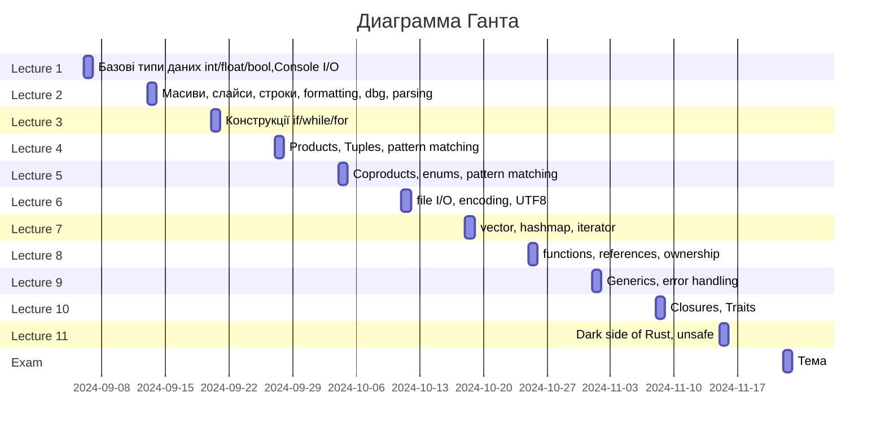

### Mermaid Gantt Diagrams

```mermaid
gantt
    title Диаграмма Ганта
    dateFormat YYYY-MM-DD
    section Lecture 1
        Базові типи даних int/float/bool,Console I/O: 2024-09-06, 1d
    section Lecture 2
        Масиви, слайси, строки, formatting, dbg, parsing: 2024-09-13, 1d
    section Lecture 3
        Конструкції if/while/for: 2024-09-20, 1d
    section Lecture 4
        Products, Tuples, pattern matching: 2024-09-27, 1d
    section Lecture 5
        Coproducts, enums, pattern matching: 2024-10-04, 1d
    section Lecture 6
        file I/O, encoding, UTF8: 2024-10-11, 1d
    section Lecture 7
        vector, hashmap, iterator: 2024-10-18, 1d
    section Lecture 8
        functions, references, ownership: 2024-10-25, 1d
    section Lecture 9
        Generics, error handling: 2024-11-01, 1d
    section Lecture 10
        Closures, Traits: 2024-11-08, 1d
    section Lecture 11
        Dark side of Rust, unsafe: 2024-11-15, 1d
    section Exam
        Тема: 2024-11-22, 1d
```
